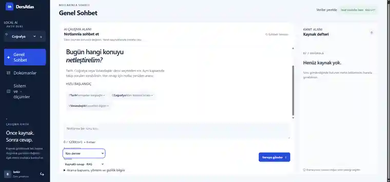
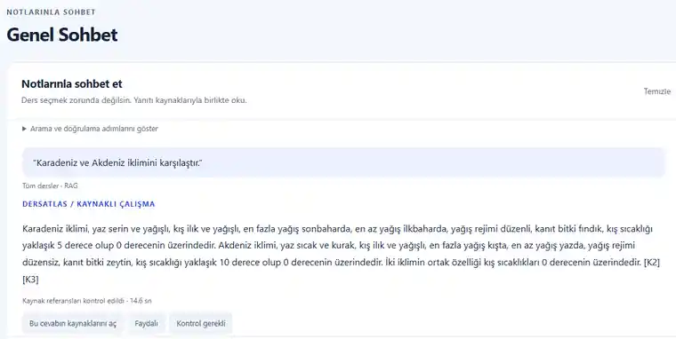
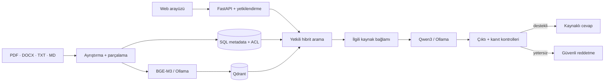
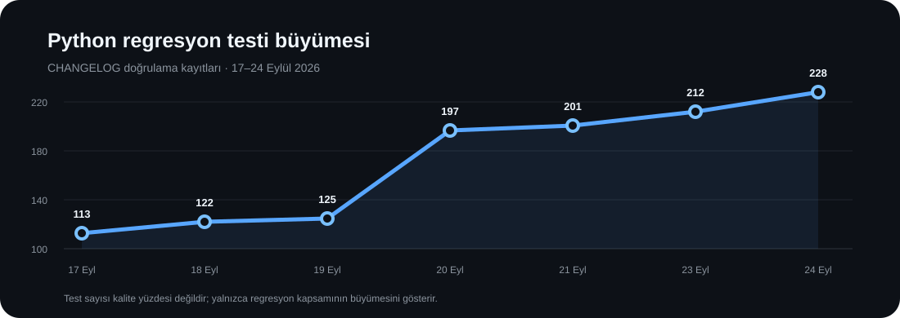

<div align="center">

# DersAtlas

### Notlarından öğren. Kaynağını gör. Verini yerelde tut.

**Ollama tabanlı yerel LLM + kaynak denetimli RAG ile çalışan çok dersli çalışma asistanı.**  
PDF, DOCX, TXT ve Markdown notlarını işler; cevaplarını erişim kontrollü yerel kaynaklardan üretir ve kullandığı kanıtı ders, dosya ve sayfa bilgisiyle gösterir.

[](https://github.com/bekiroruk/LLM_dersatlas/actions/workflows/ci.yml)


</div>

<p align="center">
  
</p>

> **DersAtlas'ın hedefi modelin ezberinden cevap vermek değil; kullanıcının kendi notlarında kanıt bulmak, cevabı o kanıta bağlamak ve kanıt yetersizse bunu açıkça söylemektir.**

## Neler yapıyor?

| Yetkinlik | Davranış |
| --- | --- |
| **Çok formatlı doküman işleme** | PDF, DOCX, TXT ve Markdown içeriklerini ayrıştırır, parçalara böler ve ders metadatasıyla indeksler. |
| **Genel Sohbet** | Ders seçmeden erişebildiğin tüm notlarda arama yapar; istenirse tek ders filtresiyle sınırlandırılır. |
| **Kaynaklı cevap** | Kaynak kartlarında ders, dosya, fiziksel PDF sayfası ve ilgili metin gösterilir. |
| **Hibrit RAG** | SQL metadatası + Qdrant vektör araması aynı yetkili kapsam içinde birlikte çalışır. |
| **Kanıt denetimi** | İlişkisiz, eksik veya yanlış bağlanmış parçaların cevap gibi sunulmasını engelleyen kaynak sözleşmeleri uygular. |
| **Araştırma ajanı** | Yalnızca `search_notes(query)` kullanan, tur ve kaynak sayısı sınırlandırılmış salt-okunur araştırma akışı sağlar. |
| **Takip soruları** | Son konuşma bağlamını yalnızca göndermeleri çözmek için kullanır; her cevapta kaynakları yeniden arar. |
| **Güvenli reddetme** | Yeterli kanıt yoksa PDF/OCR parçalarını gelişigüzel birleştirmek yerine kaynak yetersiz sonucu üretir. |

## Gerçek yerel çıktı örneği

<p align="center">
  
</p>

Bu görüntü, **gerçek yerel model + gerçek notlar** ile yapılan kaynaklı cevap akışından alınmıştır. Yanıttaki `[K…]` işaretleri kaynak kartlarına bağlanır ve kullanılan parçalar kullanıcı tarafından ayrıca incelenebilir. Görüntü önceki arayüz revizyonuna aittir; güncel çalışma alanı üstteki ekran görüntüsüdür.

## Nasıl çalışıyor?



Sunucu, istemcinin gönderdiği ders kapsamına körü körüne güvenmez; erişilebilir ders ve dokümanları sunucu tarafında doğrular. Konuşma geçmişi de kanıt değildir: takip sorusu çözüldükten sonra SQL/Qdrant araması yeniden yapılır ve yeni cevap güncel kaynaklarla doğrulanır.

## Yerel-first tasarım

- Kullanıcı dokümanları, indeksler ve model çıkarımı yerel çalışma altyapısında tutulur.
- Sohbet bağlamı yalnızca açık sayfanın belleğinde, **en fazla 4 tur / 6000 karakter** olarak tutulur; kalıcı sohbet tablosuna yazılmaz.
- Araştırma ajanında shell, SQL, ağ, yazma veya silme aracı yoktur.
- PDF'ler, `.env`, veritabanları, vektör indeksleri ve model dosyaları GitHub deposuna dahil edilmez.
- İlk paket/model indirmeleri çevrimiçi olabilir; gerçek air-gap kullanımı ayrıca ortam seviyesinde doğrulanmalıdır.

## Doğrulama görünümü

<table>
<tr>
<td align="center"><strong>228</strong><br><sub>Python regresyon testi</sub></td>
<td align="center"><strong>19</strong><br><sub>JavaScript arayüz mantığı testi</sub></td>
<td align="center"><strong>8</strong><br><sub>Genel ajan kabul sorusu</sub></td>
<td align="center"><strong>3 + 2</strong><br><sub>Ders + kaynak-dışı kapsam</sub></td>
</tr>
</table>

<p align="center">
  
</p>

Son doğrulama kayıtlarında **228 Python testi ve 19 JavaScript arayüz mantığı testi** başarılıdır. Genel kabul kümesi Tarih, Coğrafya ve Vatandaşlık sorularının yanında kaynak-dışı soruları da içerir; kaynak kapsamı, cevap kapsamı, cevaplanabilirlik/reddetme ve gecikme ölçümleri ayrı tutulur.

> **Not:** Test sayısı bir doğruluk yüzdesi değildir. Gerçek LLM çıktısı, kullanılan notlar ve donanım için kontrollü kabul değerlendirmesi ayrıca yapılmalıdır. Ayrıntılar: [`docs/QUALITY.md`](docs/QUALITY.md).

## Öne çıkan güvenlik / kalite kararları

DersAtlas yalnızca “en benzer parçayı bul ve modele ver” yaklaşımı değildir. Regresyon kümesi özellikle şu hata sınıflarını hedefler:

- `fethedildi` ile `Fethiye` gibi yüzeysel benzerliklerin yanlış kanıt sayılması,
- bir dönemin tarih aralığının bir fermanın ilan süresi gibi sunulması,
- kişi ile eylemin aynı kaynak biriminde açıkça bağlı olmadığı halde “ilan etti / hazırladı” sonucuna varılması,
- PDF tablosu düzleştiğinde farklı sütunların birbirine bağlanması,
- karşılaştırma sorularında bir tarafın kanıtının diğer tarafa taşınması,
- kaynak dışı sorulara notlardan uydurma cevap üretilmesi,
- önceki sohbet cevabının yeni soruda kanıt gibi yeniden kullanılması.

Bu kontrollerin ayrıntılı gerekçesi ve gerçek hata örneklerinden doğan düzeltmeler [`CHANGELOG.md`](CHANGELOG.md) ve [`docs/QUALITY.md`](docs/QUALITY.md) içinde tutulur.

## Teknoloji yığını

| Katman | Teknoloji |
| --- | --- |
| API | FastAPI · Uvicorn · Pydantic Settings |
| Yerel LLM | Ollama · Qwen3 |
| Embedding | BGE-M3 |
| Vektör arama | Qdrant |
| İlişkisel veri | SQLAlchemy · SQLite / opsiyonel SQL Server |
| Doküman işleme | pypdf · python-docx |
| Arayüz | HTML · CSS · JavaScript |
| Test | Pytest · DOM mantık testleri |
| Paketleme / çalışma | PowerShell · Docker Compose seçenekleri |

## Windows'ta hızlı başlangıç

```powershell
git clone https://github.com/bekiroruk/LLM_dersatlas.git
cd LLM_dersatlas
.\scripts\setup.ps1
.\scripts\start.ps1
```

`start.ps1` bu projeye ait eski Uvicorn sürecini güvenli biçimde kapatır, doğru veri yollarını kullanır, çalışan RAG sürümünü `/health` üzerinden doğrular ve arayüzü açar.

Gerçek yerel model ve yüklenmiş notlarla kabul koşusu:

```powershell
.\scripts\acceptance.ps1
```

Sunucu zaten doğru sürümle açıksa:

```powershell
.\scripts\acceptance.ps1 -NoStart
```

Durdurmak için:

```powershell
.\scripts\stop.ps1
```

## Repo haritası

```text
LLM_dersatlas/
├─ app/                  # API, RAG, güvenlik, sağlayıcılar, worker
├─ dist/                 # Yerel web arayüzü
├─ docs/                 # Mimari, kalite, geliştirme ve kullanım belgeleri
├─ samples/              # Değerlendirme veri kümeleri
├─ scripts/              # Setup, start/stop, acceptance, evaluate, repo guard
├─ tests/                # Python + arayüz mantığı regresyonları
├─ compose*.yaml         # Standart / GPU / offline çalışma seçenekleri
└─ README.md
```

## Teknik belgeler

- 🧭 [`docs/ARCHITECTURE.md`](docs/ARCHITECTURE.md) — sistem bileşenleri, veri akışı ve güven sınırları
- 💬 [`docs/GENERAL_CHAT.md`](docs/GENERAL_CHAT.md) — Genel Sohbet, takip bağlamı ve araştırma ajanı
- 🧪 [`docs/QUALITY.md`](docs/QUALITY.md) — RAG kalite yaklaşımı, regresyonlar ve kabul değerlendirmesi
- 🛣️ [`docs/ROADMAP.md`](docs/ROADMAP.md) — planlanan geliştirmeler
- 🛠️ [`docs/DEVELOPMENT.md`](docs/DEVELOPMENT.md) — geliştirme ve gün sonu akışı
- 🔐 [`SECURITY.md`](SECURITY.md) — güvenlik politikası
- 🧾 [`CHANGELOG.md`](CHANGELOG.md) — gerçek değişiklikler ve doğrulama kayıtları

---

<div align="center">

**DersAtlas — kaynak gösteren, yerel çalışan ve “bilmiyorum” diyebilen çalışma asistanı.**

</div>
