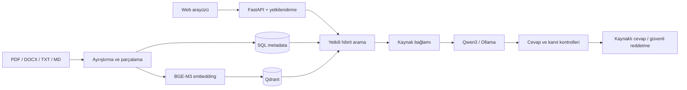

# DersAtlas

**DersAtlas**, kişisel ders notları üzerinde çalışan yerel bir **LLM + RAG çalışma asistanıdır**. PDF, DOCX, TXT ve Markdown belgelerini indeksler; sorulara yalnızca yetkili kaynaklar içinden cevap üretir ve kullandığı kanıtları dosya ve sayfa bilgisiyle gösterir.

[](https://github.com/bekiroruk/LLM_dersatlas/actions/workflows/ci.yml)


## Amaç

DersAtlas'ın temel hedefi modelin genel bilgisinden cevap vermesi değil, **kullanıcının kendi notlarında kanıt bulması ve cevabı bu kanıta bağlamasıdır**.

Kaynak yeterli değilse sistemin tahmin üretmesi yerine bunu açıkça belirtmesi hedeflenir.

## Temel özellikler

| Özellik | Açıklama |
| --- | --- |
| **Yerel LLM** | Ollama üzerinden yerel model çalıştırır. |
| **Çoklu doküman desteği** | PDF, DOCX, TXT ve Markdown belgelerini işler. |
| **Çok dersli yapı** | Birden fazla ders ve doküman aynı çalışma alanında yönetilebilir. |
| **Genel Sohbet** | Kullanıcının erişebildiği tüm derslerde arama yapabilir. |
| **Ders filtresi** | Arama gerektiğinde tek bir dersle sınırlandırılabilir. |
| **Kaynaklı cevap** | Ders, dosya, fiziksel PDF sayfası ve kaynak metni gösterilir. |
| **Hibrit RAG** | SQL metadata doğrulaması ile Qdrant vektör aramasını birlikte kullanır. |
| **Takip soruları** | Kısa konuşma bağlamını göndermeleri çözmek için kullanır; kaynakları yeniden arar. |
| **Güvenli reddetme** | Yeterli kanıt bulunamazsa kaynak dışı cevap üretmemeyi hedefler. |
| **Salt-okunur araştırma ajanı** | Araştırma akışı yalnızca notlarda arama yapabilen sınırlı bir araç kullanır. |

## Sistem mimarisi



### Cevap akışı

1. Kullanıcı soru gönderir.
2. Sunucu kullanıcının erişebildiği ders ve doküman kapsamını doğrular.
3. Soru için ilgili kaynak parçaları aranır.
4. Bulunan parçalar modele bağlam olarak verilir.
5. Üretilen cevap kaynak desteği açısından kontrol edilir.
6. Sonuç kaynaklarıyla birlikte kullanıcıya döndürülür.

Konuşma geçmişi kanıt olarak kabul edilmez. Takip sorusundaki referans çözüldükten sonra kaynak araması yeniden yapılır.

## Teknoloji yığını

| Katman | Teknoloji |
| --- | --- |
| API | FastAPI, Uvicorn, Pydantic Settings |
| Yerel LLM | Ollama, Qwen3 |
| Embedding | BGE-M3 |
| Vektör veritabanı | Qdrant |
| İlişkisel veri | SQLAlchemy |
| Doküman işleme | pypdf, python-docx |
| Arayüz | HTML, CSS, JavaScript |
| Test | Pytest, JavaScript UI logic tests |
| Çalıştırma | PowerShell, Docker Compose seçenekleri |

## Kalite yaklaşımı

Regresyon testleri özellikle RAG sistemlerinde sık görülen şu hata sınıflarını hedefler:

- yüzeysel kelime benzerliği nedeniyle yanlış kaynak seçimi,
- tarih veya dönem bilgisinin yanlış ilişkiye dönüştürülmesi,
- kişi ile eylem arasında kaynakta bulunmayan bağ kurulması,
- PDF tabloları düzleştiğinde farklı sütunların birbirine bağlanması,
- karşılaştırma sorularında iki tarafın kanıtlarının karıştırılması,
- kaynak dışı sorulara notlardan uydurma cevap üretilmesi,
- önceki sohbet cevabının yeni soruda kanıt gibi kullanılması.

Güncel doğrulama kayıtlarında **228 Python regresyon testi** ve **19 JavaScript arayüz mantığı testi** bulunur.

> Test sayısı bir doğruluk yüzdesi değildir. Gerçek LLM çıktısının kalitesi ayrıca kabul değerlendirmeleriyle kontrol edilir.

Ayrıntılar için: [docs/QUALITY.md](docs/QUALITY.md)

## Yerel çalışma ve veri yaklaşımı

- Kullanıcı dokümanları ve indeksler yerel çalışma ortamında tutulur.
- Model çıkarımı Ollama üzerinden yerel olarak yapılır.
- Sohbet bağlamı kalıcı sohbet geçmişi olarak veritabanına yazılmaz.
- Araştırma ajanına shell, SQL, dosya yazma/silme veya genel ağ erişimi verilmez.
- PDF dosyaları, `.env`, yerel veritabanları, vektör indeksleri ve model dosyaları repoya eklenmez.

> İlk paket ve model kurulumları internet bağlantısı gerektirebilir. Tam air-gap kullanım ayrıca ortam seviyesinde yapılandırılmalıdır.

## Kurulum

### Gereksinimler

- Windows
- Python 3.11+
- Ollama
- Git
- PowerShell

Projeyi klonlayın:

```powershell
git clone https://github.com/bekiroruk/LLM_dersatlas.git
cd LLM_dersatlas
```

Kurulumu çalıştırın:

```powershell
.\scripts\setup.ps1
```

Uygulamayı başlatın:

```powershell
.\scripts\start.ps1
```

Uygulamayı durdurmak için:

```powershell
.\scripts\stop.ps1
```

## Kabul testi

Yerel model ve yüklenmiş notlarla kabul akışını çalıştırmak için:

```powershell
.\scripts\acceptance.ps1
```

Sunucu zaten doğru sürümle çalışıyorsa:

```powershell
.\scripts\acceptance.ps1 -NoStart
```

## Proje yapısı

```text
LLM_dersatlas/
├── app/                  # API, RAG, güvenlik, sağlayıcılar ve worker
├── dist/                 # Web arayüzü
├── docs/                 # Teknik dokümantasyon
├── samples/              # Değerlendirme örnekleri
├── scripts/              # Setup, start/stop, acceptance ve yardımcı araçlar
├── tests/                # Python ve UI regresyon testleri
├── compose.yaml
├── compose.gpu.yaml
├── compose.offline.yaml
└── README.md
```

## Dokümantasyon

- [Mimari](docs/ARCHITECTURE.md)
- [Genel Sohbet ve araştırma ajanı](docs/GENERAL_CHAT.md)
- [Kalite ve regresyon testleri](docs/QUALITY.md)
- [Geliştirme rehberi](docs/DEVELOPMENT.md)
- [Yol haritası](docs/ROADMAP.md)
- [Üretim ve güvenlik](docs/URETIM_VE_GUVENLIK.md)
- [Güvenlik politikası](SECURITY.md)
- [Değişiklik kaydı](CHANGELOG.md)

## Proje durumu

DersAtlas aktif olarak geliştirilmektedir. Mevcut sürüm; yerel doküman indeksleme, çok dersli RAG araması, kaynaklı cevap üretimi, takip soruları, erişim kontrolü ve regresyon test altyapısını içerir.
