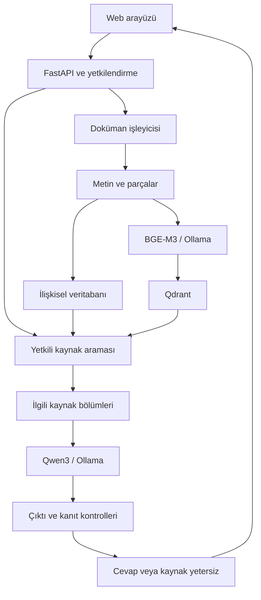

# DersAtlas mimarisi

## Kapsam

Bu belge repodaki uygulamanın bileşenlerini açıklar. Dokümanlar derslere göre düzenlenir; Genel Sohbet varsayılan olarak kullanıcının erişebildiği bütün derslerde arar.

## Doküman işleme ve soru-cevap

İlk model ve paket indirmeleri çevrimiçi olabilir; kullanıcı dokümanları ve model çıkarımı yerel çalışma altyapısında tutulur. Ağ çıkışının gerçekten kapalı olduğu ayrıca gözlemlenmelidir.

## Dosyaların sorumlulukları

Uygulama kökünde şu eşleştirme kullanılır:

| Dosya | Sorumluluk |
| --- | --- |
| app/main.py | API sözleşmesi, oturum, erişim ve sorgu ölçümleri |
| app/providers.py | Ollama istemcisi ve Qdrant işlemleri |
| app/rag.py | Soru normalizasyonu, arama, kaynak uygunluğu ve cevap doğrulama |
| app/conversation.py | Sınırlı istek bağlamı ve takip sorusunu bağımsız soruya çevirme; kanıt değildir |
| app/db.py | SQL modelleri ve veritabanı bağlantısı |
| app/migrations.py | Eski SQLite sorgu ölçümlerinin veriyi koruyan şema geçişi |
| app/security.py | Yetkili dersler ve erişim kontrolü |
| app/worker.py | Arka plan doküman işleme |
| dist/index.html | Arayüz yapısı |
| dist/assets/app.js | İstemci durumu, API çağrıları, kaynak kartları |

Bu depo hazırlığındaki araçlar:

| Dosya | Sorumluluk |
| --- | --- |
| scripts/repo_guard.py | Git indeksinde yasak materyal ve bazı bilinen secret biçimlerini denetleme |
| scripts/gun_sonu.py | Sınırlandırılmış, onaylı test/commit/push akışı |
| scripts/run_tests.py | Başarısız veya atlanan testlerde başarısız çıkış |
| tests/test_repository.py | Depo güvenliği ve gün sonu aracının regresyonları |

## Mevcut arama kapsamı

API'de subject_id verilmezse veya null ise sunucu sahiplik/üyelik üzerinden tüm yetkili dersleri hesaplar; tek id verilirse erişimi doğrulayıp aramayı o dersle sınırlar. SQL ve Qdrant aramaları aynı yetkili kapsamı kullanır. Qdrant sonuçları ayrıca hazır dokümanların SQL kayıtlarıyla doğrulanır.

Ders uygunluğu, soru-cevap uygunluğu ile aynı şey değildir: Coğrafya belgesinde İstanbul ve Fethiye sözcüklerinin bulunması, İstanbul'un fethi hakkında kanıt oluşturmaz.

Kaynak kontrolleri şu düzeylerde ele alınmalıdır:

1. Kullanıcı kaynağa erişebilir mi?
2. Kaynak seçilen arama kapsamına dahil mi?
3. Aynı kaynak bölümünde sorunun konusu ve gereken bilgi bulunuyor mu?
4. Üretilen cevap, gösterilen kaynak bölümü tarafından destekleniyor mu?
5. Cevap gerçekten soruyu yanıtlıyor mu?

Kaynak kimliklerinin geçerli olması yalnızca bu kontrollerin bir kısmıdır.

Açık iki-konulu takip sorularında arama, birleşik soruya ek olarak her konu ve istenen özellik için iki alt sorguya ayrılır. Her iki konuyu yalnızca bir kategori listesinde anan geniş parçalar yerine, tek konu ile özelliği doğrudan bağlayan parçalar önce sıralanır. Doğrulayıcı iki taraf için açık kanıt bulamazsa ham PDF satırları karşılaştırma cevabı olarak kullanılmaz.

## Genel Sohbet ve araştırma ajanı

Doküman yükleme ekranındaki ders seçimi ile sohbetin arama kapsamı ayrıdır:

- Dokümanların subject_id metadatası korunur.
- Varsayılan sohbet tüm **yetkili** subject_id değerlerinde arar.
- İsteğe bağlı tek ders filtresi desteklenir.
- API, istemcinin gönderdiği ders listesini güvenilir kabul etmez; erişim kapsamını sunucuda hesaplar.
- Kaynak kartı ders adı, dosya adı ve fiziksel PDF sayfasını içerir.
- Genel sorgular QueryMetric.subject_id=null ile kaydedilir; SQLite başlangıcında eski tablo yedek alındıktan sonra idempotent biçimde geçirilir.
- Sohbet bağlamı yalnızca göndermeleri çözer; her cevap için yeniden yetkili arama ve kanıt kontrolü yapılır.

Global arama için Qdrant filtresini tamamen kaldırmak yeterli ve güvenli bir çözüm değildir.

Araştırma ajanının tek aracı search_notes(query)'dir. Varsayılan en fazla 3 tur ve tur başına 2 çağrı yapar; toplam en fazla 10 kaynak biriktirir. Araç parametresinde ders veya kullanıcı seçilemez. Her arama sunucudaki erişim kontrolünden geçer. Shell, SQL, ağ veya yazma/silme aracı yoktur. Son cevap mevcut RAG kanıt kontrollerinden geçer; ajan cevabın kesin doğru olmasını garanti etmez.

## Kalıcı ve geçici veri

Kalıcı veri: kullanıcılar, yetkiler, dersler, dokümanlar, parçalar, indeksler ve sorgu ölçümleri.

Konuşma bağlamı yalnızca açık sayfanın RAM'inde, en fazla 4 tur / 6000 karakter olarak tutulur. İstekte güvenilmeyen veri olarak yerel modele gönderilir; sorgu/cevap üretimi bittikten sonra uygulama bunu kalıcı geçmişe kaydetmez. Temizle, çıkış, yenileme ve arama kapsamı değişimi bağlamı sıfırlar. Sunucuda paylaşılan hafıza, localStorage/sessionStorage veya sohbet tablosu yoktur.

Bağlam çözümleyicisi yalnızca referansları açan bir soru üretir; araç kullanamaz. Son bağımsız sorudaki açık iki-konu karşılaştırmasına yapılan aynı isimli “bu iki …” göndermesi ve kısa anlatım isteği önce dar kurallarla çözülür; konu adları dışında bilgi eklenmez. Diğer göndermeler mevcut yerel model yolundan geçer. Önceki cevap cevaplayıcıya kanıt olarak aktarılmaz. Yeni konuda özgün soru korunur; belirsiz/bozuk yeniden yazımda kullanıcıdan konu adı istenir ve güvenli ret kodu adımlarda gösterilir. Yeni arama aynı SQL/Qdrant yetkileriyle çalışır; eski etiketler yeni kaynaklara bağlanmaz. Tarih/sayı değiştiren yeniden yazım reddedilir; bu kontrol genel bir anlamsal doğruluk garantisi değildir.

Gömülü Qdrant veri dizini tek süreç tarafından açılır. Sunucuyu tekrar başlatmadan önce mevcut Uvicorn süreci durdurulur; kilit dosyaları veya veri dizini silinmez.
