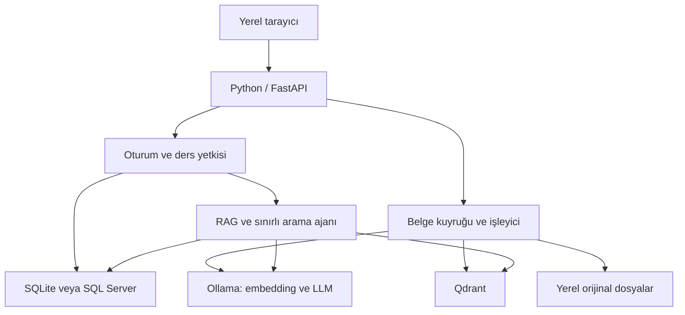
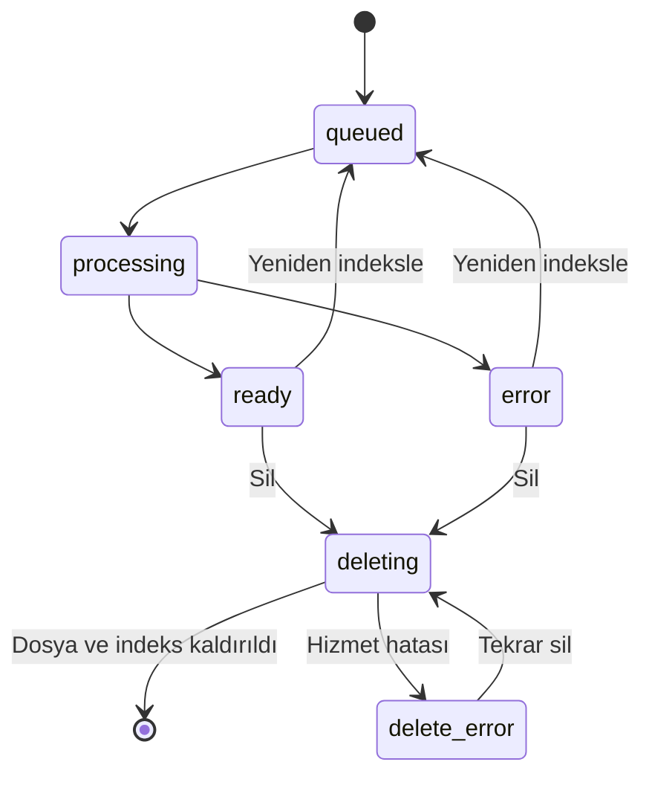

# DersAtlas - uçtan uca mimari

## 1. Projenin sınırı

İlk kullanıcı Bekir, ilk veri alanı tarih ders notlarıdır. Sonraki dersler aynı uygulamada ayrı veri alanları olarak açılır. Amaç, iş ilanındaki on-premise LLM, Python otomasyonu, RAG, API, veri güvenliği ve model izleme başlıklarını gerçek bir kullanım senaryosunda öğrenmek ve uygulamaktır.

Bu proje genel bilgi sohbet botu veya internet araştırmacısı değildir. İlk sürüm kendi yüklediğin notlardan cevap üretir. Notların eksik veya hatalıysa model bunları otomatik biçimde güvenilir tarih bilgisine dönüştürmez. Sınav hazırlığında kaynak ve insan kontrolü gerekir.

## 2. Hangi teknolojiyi nerede kullanacağız?

| Teknoloji / kavram | Nerede kullanılır? | Bu projedeki görev | Kullanılmayan alternatif / neden |
| --- | --- | --- | --- |
| Python | Backend | Dosya işleme, arama, yetki, otomasyon | C++ kodu yazmıyoruz |
| FastAPI | `app/main.py` | HTTP uç noktaları, giriş, yükleme, sorgu | Şimdilik Django/Node backend yok |
| HTML / CSS / JavaScript | `dist/` | Yerel tarayıcı arayüzü | React/Next.js zorunlu değil; ayrı Node kurulum yükü yok |
| Ollama | Bilgisayardaki model servisi | Yerel `/api/chat` ve `/api/embed` | vLLM yüksek eşzamanlılık ihtiyacında sonraki seçenek |
| Qwen3 4B | Ollama üzerinde | Kaynaklara dayanarak Türkçe cevap ve araç seçimi | Kesin en iyi model iddiası yok; donanım ve notlarla karşılaştırılacak |
| BGE-M3 | Ollama üzerinde ayrı model | Metinleri arama vektörlerine dönüştürme | Cevap üretmez; LLM'in yerine geçmez |
| Qdrant | Gömülü disk veya ayrı servis | Anlamsal benzerlik araması ve ders filtresi | SQL veritabanının yerine geçmez |
| BM25 | `app/ranking.py` | Tarih, isim ve terimlerde kelime eşleşmesi | Vektör aramasının yakalayamadığı tam eşleşmelere destek |
| RRF | `app/ranking.py` | İki sıralama listesini birleştirme | Sonuç puanı doğruluk yüzdesi değildir |
| SQLAlchemy | `app/db.py` | Parametreli ilişkisel veri erişimi | LLM'e serbest SQL çalıştırma yetkisi verilmez |
| SQLite | Başlangıç profili | Kurulumsuz, kalıcı ilişkisel kayıtlar | Çok sunuculu kurumsal dağıtım hedefi değil |
| SQL Server + pyodbc | `.env` bağlantı seçeneği | Aynı şemayla kurumsal ilişkisel veritabanı | Sunucu ve sürücü kurulumu ayrıca gerekir |
| pypdf / python-docx | `app/ingestion.py` | Kaynak metni ve konumu çıkarma | OCR ve görsel anlama otomatik yapılmaz |
| Docker Compose | Kurulum alternatifi | Uygulama, Ollama, Qdrant servislerini ayırma | İlk Windows kurulumunda zorunlu değil |
| unittest / pytest | `tests/` | Mantık, erişim ve API kontrolleri | Model kalitesini tek başına ölçmez |
| Sınırlı ajan | `app/rag.py` | LLM'in gerektiğinde ek not araması istemesi | Multi-agent, shell, e-posta ve dosya değiştirme yok |

LLM, RAG ve agent birbirinin rakibi değildir: LLM modeldir; RAG bilgi getirme ve cevaplama düzenidir; agent ise hangi aracı hangi adımda kullanacağını modelin seçtiği çalışma biçimidir. LLM kendi başına da çok adımlı çıkarım yapabilir; “çok adım” tek başına bir sistemi agent yapmaz.

## 3. Genel sistem

Tarayıcı doğrudan Ollama veya Qdrant'a bağlanmaz. Bütün istekler yetki kontrolü olan Python API'den geçer. İlişkisel veritabanı kullanıcı, ders erişimi ve belgenin hazır olup olmadığı için asıl doğruluk kaynağıdır. Vektör indeksi yeniden üretilebilir bir türevdir.

## 4. Doküman yüklediğinde ne olur?

1. Giriş oturumu ve seçili derse yazma yetkisi kontrol edilir.
2. İstek ve dosya boyutu, dosya uzantısı ve güvenli isim kuralları kontrol edilir.
3. Orijinal dosya UUID adıyla `data/originals` içine kaydedilir. SHA-256 ile aynı derste aynı içeriğin tekrar yüklenmesi engellenir.
4. SQL'de `queued` kayıt oluşur. Arayüz yüklemeyi tamamlanmış gösterirken “işleniyor” durumunu ayrıca takip eder.
5. Tek arka plan işleyicisi sıradaki kaydı alır; `processing` yapar.
6. PDF sayfaları, DOCX paragrafları/tabloları veya metin blokları çıkarılır. Metni olmayan PDF için OCR uyarısı/hatası oluşturulur.
7. Bölümler başlangıçta en fazla 1600 karakter, 220 karakter örtüşme ile parçalanır. Bu değerler token değil karakter sayısıdır.
8. Her parça için BGE-M3 embedding üretilir; Qdrant'a vektör, parça kimliği, ders kimliği ve belge kimliği yazılır.
9. Aynı parça metni ve konum bilgisi SQL'de saklanır. Son parça da tamamlanınca belge `ready` olur ve aramaya açılır.
10. Hata olursa belge `error` durumuna alınır. Yarım indeksli belgeler sorguya dahil edilmez. “Yeniden indeksle” eski parçaları temizleyip işlemi yeniden yapar.

SQL ve Qdrant tek bir dağıtık transaction içinde değildir. Güvenlik ve tutarlılık, `ready` filtresi ve yeniden denemede temizleme ile sağlanmaya çalışılır. Kesintiyle kalmış vektörler belgenin SQL durumu hazır olmadıkça cevaplamada kullanılmaz. Büyük kurumsal kullanımda ayrı iş kuyruğu, reconciliation görevi ve izole ayrıştırma işleyicileri gerekir.

## 5. Soru sorduğunda ne olur?

1. Sunucu oturumdan kullanıcıyı çıkarır; tarayıcıdan gelen bir kullanıcı kimliğine güvenmez.
2. Kullanıcının seçili derse erişimi doğrulanır.
3. Yalnızca o dersteki `ready` ve aktif embedding modeliyle oluşturulmuş parçalar adaydır.
4. Soru BGE-M3 ile vektöre çevrilir. Qdrant araması `subject_id` filtresiyle yapılır.
5. Aynı dersin metinlerinde BM25 kelime araması çalışır. İsimler ve yıllar için ikinci bir yakalama yolu sunar.
6. Sonuçlar RRF ile birleştirilir. Başlangıçta en fazla 6 parça alınır.
7. Aday yoksa bilgi yetersizliği cevabı verilir; LLM'e rastgele cevap ürettirilmez.
8. Aday parçalar K1, K2 gibi kimlikler alır. Kaynaklar “talimat değil veri” olarak sistem yönergesiyle modele gönderilir.
9. LLM'den cevap, kullanılan kaynak kimlikleri ve yetersizlik bayrağı içeren JSON istenir.
10. Sunucu kaynak kimliklerinin gerçekten verilen parçalara ait olduğunu kontrol eder. Kimlikler geçersizse model cevabını yayımlamaz.
11. Cevap, metin alıntıları, dosya adı, kaynak konumu ve süre arayüze gider. Sorgu metni değil, yalnızca operasyon metriği kalıcı tutulur.

**Sınır:** Kaynak kimliği doğrulaması, bir tarih iddiasının gerçekten o metinden çıktığını anlamsal olarak kanıtlamaz. Model alıntıyı yanlış yorumlayabilir. “Cevap yüzde 100 doğru” veya “halüsinasyon sıfır” sözü verilemez.

## 6. Agent modu ne ekler?

Normal RAG: kullanıcı sorusu ile bir arama turu ve bir kaynaklı cevap üretimi.

Agent: ilk aramadan sonra LLM'e yalnızca `search_notes(query)` aracı sunulur. Model gerekirse soruyu alt sorulara böler. En fazla 3 tur ve her turda 2 araç çağrısı kabul edilir. Araç şemasına ek alanlar ve bilinmeyen araçlar reddedilir. Ders ve kullanıcı kapsamı sunucuda sabittir. Son cevap yine aynı kaynak doğrulama yolundan geçer.

Örnek: “Tanzimat ve Islahat fermanlarını amaç ve kapsam bakımından karşılaştır.” Ajan önce Tanzimat'ı, sonra Islahat'ı ayrıca aramayı seçebilir. Bu seçim ve sorgular arayüzde araç işlem kaydı olarak görünür. Modelin iç düşünce zinciri gösterilmez veya saklanmaz.

Agent daha yavaş ve daha fazla bellek/hesaplama tüketebilir. Aynı soruyu normal RAG iyi çözüyorsa ajan kullanmak zorunlu değildir. SAP'ye yazma, bilgisayarda komut çalıştırma veya keyfî API çağrısı bu araca verilmemiştir.

## 7. Veritabanı modeli

| Tablo | Sakladığı bilgi | İlişki / amaç |
| --- | --- | --- |
| users | Kullanıcı adı, parola hash'i, rol | Hesap kimliği |
| sessions | Token hash'i, kullanıcı, son geçerlilik zamanı | İptal edilebilir oturum |
| subjects | Ders adı, sahibi | Her ders ayrı erişim alanı |
| memberships | Kullanıcı + ders | Ek okuma izni |
| documents | Ders, orijinal ad, SHA, durum, model etiketi | Kalıcı iş durumu ve belge bilgisi |
| chunks | Belge, ders, metin, konum, sıra | Kaynak gösterme ve kelime araması |
| query_metrics | Kullanıcı, ders, süre, sonuç, geri bildirim | İzleme; soru/cevap metni yok |
| audit_events | İşlemi yapan, işlem, hedef kimliği, zaman | Sınırlı denetim izi; değiştirilemez log değildir |

Bir kullanıcı birçok dersin sahibi olabilir. Bir ders birçok üyeye okuma izni verebilir. Bir belge tek bir derse aittir; bir belgede birçok parça vardır. Aynı belgeyi Coğrafya dersine de yüklersen ayrı bir ders kaydı ve indeks oluşur. Genel Sohbet varsayılan olarak kullanıcının erişebildiği bütün dersleri arar; isteğe bağlı ders filtresi kapsamı tek derse indirir.

## 8. Dosya yapısı - nereyi açıp inceleyeceksin?

| Dosya / klasör | Öğreneceğin parça |
| --- | --- |
| `app/config.py` | Ortam değişkenleri ve ayar doğrulama |
| `app/main.py` | HTTP API, oturum, yükleme, indirme ve dashboard |
| `app/passwords.py` | Tuzlu parola hash'i ve oturum token hash'i |
| `app/security.py` | Ders erişimi, sahiplik, rate limit |
| `app/db.py` | SQLAlchemy tabloları ve SQL bağlantısı |
| `app/ingestion.py` | Metin çıkarma, temizleme ve parçalama |
| `app/worker.py` | Kalıcı belge kuyruğu ve yeniden deneme |
| `app/providers.py` | Ollama ve Qdrant adaptörleri |
| `app/ranking.py` | BM25 ve RRF algoritmaları |
| `app/rag.py` | Kaynak bulma, istem, yapılandırılmış cevap, araç döngüsü |
| `app/citations.py` | Kaynak kimliği kontrolü |
| `app/cli.py` | Kullanıcı açma, parola yenileme, ders izni |
| `dist/index.html` | Arayüzün yapısı |
| `dist/assets/app.css` | Masaüstü/mobil yerel arayüz |
| `dist/assets/app.js` | API çağrıları ve etkileşimler; dış CDN yok |
| `scripts/evaluate.py` | Gerçek model değerlendirme çalıştırıcısı |
| `scripts/backup.py` | Durdurulmuş yerel veri yedeği |
| `tests/test_core.py` | Saf iş mantığı ve dosya ayrıştırma testleri |
| `tests/test_api.py` | SQLite + Qdrant ile API testleri; LLM test çifti |
| `compose*.yaml` | CPU, NVIDIA ve çevrimdışı ağ profilleri |

## 9. API sözleşmesi

| Yöntem / uç nokta | Görev |
| --- | --- |
| POST `/api/login`, POST `/api/logout` | Oturumu başlat / iptal et |
| GET `/api/me` | Mevcut kullanıcı |
| GET / POST `/api/subjects` | Yetkili dersleri listele / ders oluştur |
| GET / POST `/api/subjects/{id}/documents` | Belgeleri listele / yükle |
| POST `/api/documents/{id}/reindex` | Yeniden işlemeye al |
| DELETE `/api/documents/{id}` | Silme kuyruğuna al; aramadan hemen çıkar |
| GET `/api/documents/{id}/download` | Yetkili orijinal dosya indirme |
| GET `/api/chunks/{id}` | Yetkili kaynak metni |
| POST `/api/search` | Sadece ilgili kaynakları getir |
| POST `/api/questions` | Kaynaklı RAG / agent cevabı |
| POST `/api/queries/{id}/feedback` | Kendi sorguna geri bildirim |
| GET `/api/dashboard`, GET `/api/system` | Ölçümler ve hizmet sağlığı |
| GET `/api/openapi.json` | Makine tarafından okunabilir API tanımı |

Yazma uç noktalarında `X-Requested-With: DersAtlas` gerekir. Kimlik doğrulama HttpOnly cookie ile yapılır. Şema dışında veri gönderildiğinde doğrulama hatası alınabilir. İndirme endpoint'i orijinal dosyayı ek olarak sunar; kullanıcı dosyası arayüz HTML'i olarak çalıştırılmaz.

## 10. Diğer dersler ve değişiklik stratejisi

Yeni ders: arayüzde `+`, örneğin “Coğrafya”; sonra o derse belgelerini yükle. Backend'i kopyalamak, ayrı veritabanı veya ayrı LLM eğitmek gerekmez. Haritalar, grafikler, formüller ve fotoğraflar metin tabanlı ayrıştırmada kaybolabilir; böyle dersler için ileride OCR/VLM ve tablo koruyan ayrıştırma değerlendirilir.

LLM değiştirmek: `.env` içindeki `CHAT_MODEL` değişir, yeni yerel model indirilir ve uygulama yeniden başlatılır. Embedding değişmediği için mevcut vektörlerin yeniden üretilmesi gerekmez.

Embedding değiştirmek: `EMBED_MODEL` değişir; eski belgeler arayüzde yeniden indeksleme ister. Yeni modelin vektör boyutu farklı olabilir. Koleksiyon adı model etiketi hash'iyle ayrılır. Eski ve yeni embedding uzayları aynı aramada karıştırılmaz. Modelin aynı etiket altındaki içeriğini güncellersen sistem bunu otomatik tespit etmez; digest kaydı tutup bütün belgeleri yeniden indekslemelisin.

Parça boyutunu değiştirmek: `.env` ayarını değiştir, uygulamayı yeniden başlat ve belgeleri yeniden indeksle. Boyut değişikliği mevcut parçalara kendiliğinden uygulanmaz.

## 11. Resmî teknik kaynaklar

- Ollama sohbet API: https://docs.ollama.com/api/chat
- Ollama embedding API: https://docs.ollama.com/api/embed
- Ollama araç çağırma: https://docs.ollama.com/capabilities/tool-calling
- Yerel model adayı: https://ollama.com/library/qwen3:4b
- Embedding model adayı: https://ollama.com/library/bge-m3
- Qdrant filtreleme: https://qdrant.tech/documentation/search/filtering/
- SQL Server bağlantı ayrıntıları: https://docs.sqlalchemy.org/en/20/dialects/mssql.html

Bu kaynaklar API ve bileşen davranışlarını destekler; DersAtlas'ın senin bilgisayarında test edildiği veya seçilen modelin Türkçe tarih notlarında belirli bir başarıya ulaştığı anlamına gelmez.
